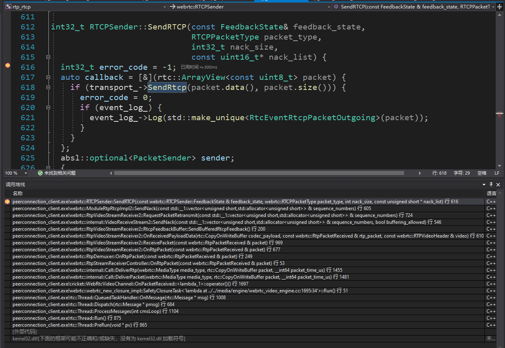
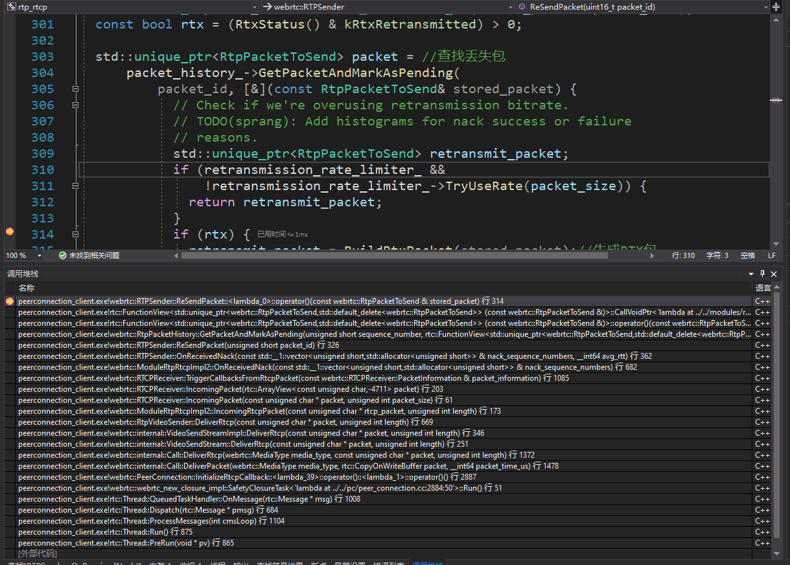
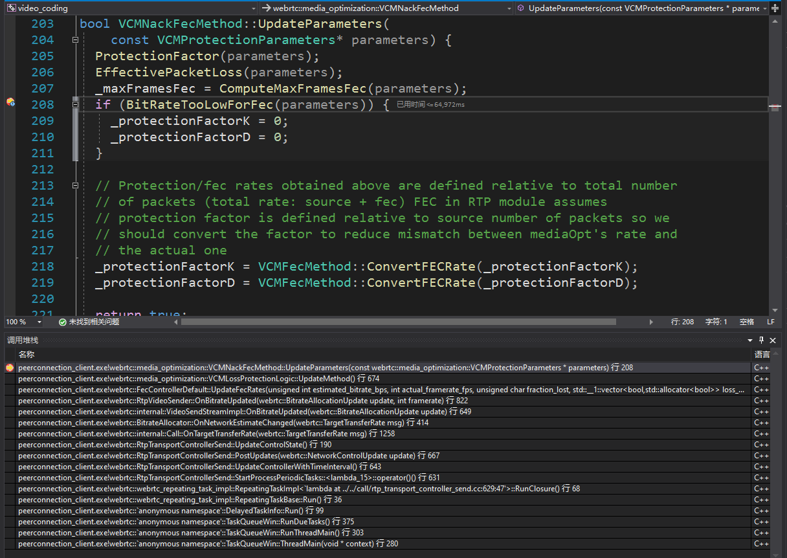

# Qos

- [Qos](#qos)
  - [Fraction lost](#fraction-lost)
  - [Jitter](#jitter)
  - [RTT](#rtt)
  - [Nack](#nack)
  - [FEC](#fec)
  - [SVC](#svc)

## Fraction lost

- 丢包分为拥塞丢包，随机丢包等。随机丢包情况下，不能通过得到的丢包率认为当前网络质量差，发生拥塞。这也是现在很多拥塞控制算法不使用丢包率作为主要衡量指标的原因。

- 在 WebRTC 中，一般是通过[Receiver Report](../rtp_rtcp/README.md#receiver-report)反馈丢包信息。RR 记录着丢包相关统计。

- 接收端计算丢包率[receive_statistics_impl.cc](https://github.com/gongluck/sourcecode/blob/main/webrtc/modules/rtp_rtcp/source/receive_statistics_impl.cc)

  <details>
  <summary>计算丢包率</summary>

  ```c++
  // 计算RTCP统计信息
  RtcpStatistics StreamStatisticianImpl::CalculateRtcpStatistics() {
    RtcpStatistics stats;
    // Calculate fraction lost.
    int64_t exp_since_last =  // 计算期望收到的包数
        received_seq_max_ - last_report_seq_max_;

    int32_t lost_since_last =  // 计算本周期的丢包数
        cumulative_loss_ - last_report_cumulative_loss_;
    if (exp_since_last > 0 && lost_since_last > 0) {
      // Scale 0 to 255, where 255 is 100% loss.
      stats.fraction_lost =  // 计算丢包率
          static_cast<uint8_t>(255 * lost_since_last / exp_since_last);
    } else {
      stats.fraction_lost = 0;
    }

    // TODO(danilchap): Ensure |stats.packets_lost| is clamped to fit in a signed
    // 24-bit value.
    stats.packets_lost = cumulative_loss_ + cumulative_loss_rtcp_offset_;
    if (stats.packets_lost < 0) {  // 防止符号位溢出
      // Clamp to zero. Work around to accomodate for senders that misbehave with
      // negative cumulative loss.
      stats.packets_lost = 0;
      cumulative_loss_rtcp_offset_ = -cumulative_loss_;
    }

    // 当前收到的最大包序列号
    stats.extended_highest_sequence_number =
        static_cast<uint32_t>(received_seq_max_);

    // Only for report blocks in RTCP SR and RR.
    last_report_cumulative_loss_ = cumulative_loss_;
    last_report_seq_max_ = received_seq_max_;

    return stats;
  }
  ```

  </details>

  <details>
  <summary>丢包统计</summary>

  ```c++
  // 更新计数
  void StreamStatisticianImpl::UpdateCounters(const RtpPacketReceived& packet) {
    --cumulative_loss_;  // 丢包数减1，如果要想得到原始丢包率，重传包就不能进入这里统计了，WebRTC提供了RTX机制，重传包用额外SSRC的包发送，这样重传包就不会干扰原始媒体包的统计。

    int64_t sequence_number =
        seq_unwrapper_.UnwrapWithoutUpdate(packet.SequenceNumber());

    if (!ReceivedRtpPacket()) {  // 第一个包
      received_seq_first_ = sequence_number;
      last_report_seq_max_ = sequence_number - 1;
      received_seq_max_ = sequence_number - 1;
    } else if (UpdateOutOfOrder(packet, sequence_number,
                                now_ms) /*检查是否乱序包*/) {
      return;
    }

    // 下面为非乱序情况

    // In order packet.
    cumulative_loss_ += sequence_number - received_seq_max_;  // 修正丢包数
    received_seq_max_ =
        sequence_number;  // 非乱序下，接收到的最大包序号自然是当前包序号
    seq_unwrapper_.UpdateLast(sequence_number);
  }

  // 乱序包更新统计
  bool StreamStatisticianImpl::UpdateOutOfOrder(const RtpPacketReceived& packet,
                                                int64_t sequence_number,
                                                int64_t now_ms) {
    if (sequence_number >
        received_seq_max_)  // 当前包序号比上个周期的最大包序号大，为非乱序包
      return false;

    // 下面是乱序情况

    return true;
  }
  ```

  </details>

- 发送端计算丢包率[send_side_bandwidth_estimation.cc](https://github.com/gongluck/sourcecode/blob/main/webrtc/modules/congestion_controller/goog_cc/send_side_bandwidth_estimation.cc)

  <details>
  <summary>计算丢包率</summary>

  ```c++
  // 更新丢包信息
  void SendSideBandwidthEstimation::UpdatePacketsLost(int64_t packets_lost,
                                                      int64_t number_of_packets,
                                                      Timestamp at_time) {
    // Check sequence number diff and weight loss report
    if (number_of_packets > 0) {
      int64_t expected =
          expected_packets_since_last_loss_update_ + number_of_packets;

      // Don't generate a loss rate until it can be based on enough packets.
      if (expected < kLimitNumPackets) {  // 阈值判断
        // Accumulate reports.
        expected_packets_since_last_loss_update_ = expected;
        lost_packets_since_last_loss_update_ += packets_lost;
        return;
      }

      has_decreased_since_last_fraction_loss_ = false;
      // 左移8位避免浮点运算
      int64_t lost_q8 = (lost_packets_since_last_loss_update_ + packets_lost)
                        << 8;
      last_fraction_loss_ = std::min<int>(lost_q8 / expected, 255);

      // Reset accumulators.
      lost_packets_since_last_loss_update_ = 0;
      expected_packets_since_last_loss_update_ = 0;
      last_loss_packet_report_ = at_time;
      UpdateEstimate(at_time);
    }
    UpdateUmaStatsPacketsLost(at_time, packets_lost);
  }
  ```

  </details>

## Jitter

- 增益参数 1/16 是为了消除噪声影响，使抖动收敛在较合理范围内，避免突发数据的影响。
- 接收端计算抖动[receive_statistics_impl.cc](https://github.com/gongluck/sourcecode/blob/main/webrtc/modules/rtp_rtcp/source/receive_statistics_impl.cc)

  <details>
  <summary>计算抖动</summary>

  ```c++
  // 更新抖动
  void StreamStatisticianImpl::UpdateJitter(const RtpPacketReceived& packet,
                                            int64_t receive_time_ms) {
    int64_t receive_diff_ms =  // 包到达时间间隔
        receive_time_ms - last_receive_time_ms_;

    uint32_t receive_diff_rtp =  // 包到达时间间隔，rtp时间戳
        static_cast<uint32_t>(
            (receive_diff_ms * packet.payload_type_frequency()) / 1000);

    int32_t time_diff_samples =  // 抖动延时
        receive_diff_rtp - (packet.Timestamp() - last_received_timestamp_);

    time_diff_samples = std::abs(time_diff_samples);

    // lib_jingle sometimes deliver crazy jumps in TS for the same stream.
    // If this happens, don't update jitter value. Use 5 secs video frequency
    // as the threshold.
    if (time_diff_samples < 450000) {  // 5秒视频频率作为阈值
      // jitter(i) = jitter(i-1) + (time_diff(i, i-1) - jitter(i-1)) / 16
      // Note we calculate in Q4 to avoid using float.
      int32_t jitter_diff_q4 =                    // time_diff*16 - jitter(i-1)*16
          (time_diff_samples << 4) - jitter_q4_;  // 左移4位，避免使用浮点运算
      jitter_q4_ +=  //(time_diff*16-jitter(i-1)*16)/16 == time_diff-jitter(i-1)
          ((jitter_diff_q4 + 8) >> 4);
    }
  }
  ```

  </details>

## RTT

- WebRTC 中目前有两种方式计算 RTT：

  - 基于媒体流发送端的计算（默认开启）。通过 [Sender Report](../rtp_rtcp/README.md#sender-report)（SR）与 [Receiver Report](../rtp_rtcp/README.md#receiver-report)（RR）携带的信息。

  - 基于媒体流接收端的计算。通过 [RTCP Extended Reports RTCP](../rtp_rtcp/README.md#extended-reports)（XR）携带的信息。

- 发送端计算 RTT[rtcp_receiver.cc](https://github.com/gongluck/sourcecode/blob/main/webrtc/modules/rtp_rtcp/source/rtcp_receiver.cc)

  <details>
  <summary>计算RTT</summary>

  ```c++
  // 处理反馈报告
  void RTCPReceiver::HandleReportBlock(const ReportBlock& report_block,
                                      PacketInformation* packet_information,
                                      uint32_t remote_ssrc) {
    int64_t rtt_ms = 0;
    uint32_t send_time_ntp = report_block.last_sr();  // SR发送时间
    if (send_time_ntp != 0) {
      uint32_t delay_ntp = report_block.delay_since_last_sr();  // 接收端处理延时
      // Local NTP time.
      uint32_t receive_time_ntp =  // RR接收时间
          CompactNtp(TimeMicrosToNtp(last_received_rb_.us()));

      // RTT in 1/(2^16) seconds.
      uint32_t rtt_ntp =  // rtt = RR接收时间 - 接收端处理延时 - SR发送时间
          receive_time_ntp - delay_ntp - send_time_ntp;
      // Convert to 1/1000 seconds (milliseconds).
      rtt_ms = CompactNtpRttToMs(rtt_ntp);
      report_block_data->AddRoundTripTimeSample(rtt_ms);

      packet_information->rtt_ms = rtt_ms;
    }
  }
  ```

  </details>

- 接收端计算 RTT[rtcp_receiver.cc](https://github.com/gongluck/sourcecode/blob/main/webrtc/modules/rtp_rtcp/source/rtcp_receiver.cc)

  <details>
  <summary>计算RTT</summary>

  ```c++
  // 处理DLRR Report Block
  void RTCPReceiver::HandleXrDlrrReportBlock(const rtcp::ReceiveTimeInfo& rti) {
    // The send_time and delay_rr fields are in units of 1/2^16 sec.
    uint32_t send_time_ntp = rti.last_rr;
    // RFC3611, section 4.5, LRR field discription states:
    // If no such block has been received, the field is set to zero.
    if (send_time_ntp == 0)
      return;

    uint32_t delay_ntp = rti.delay_since_last_rr;
    uint32_t now_ntp = CompactNtp(TimeMicrosToNtp(clock_->TimeInMicroseconds()));

    uint32_t rtt_ntp = now_ntp - delay_ntp - send_time_ntp;
    xr_rr_rtt_ms_ = CompactNtpRttToMs(rtt_ntp);
  }
  ```

  </details>

## Nack

- 关闭 FEC，以便抓包分析

  ```c++
  // webrtc/media/engine\webrtc_video_engine.cc
  //supported_formats.push_back(webrtc::SdpVideoFormat(kRedCodecName));
  //supported_formats.push_back(webrtc::SdpVideoFormat(kUlpfecCodecName));
  ```

- 关闭 SRTP，以便抓包分析

  ```c++
  // webrtc/api/peer_connection_interface.h
  disable_encryption = true;
  ```

- Conductor::CreatePeerConnection(bool dtls)配置不生成密钥

  ```c++
  // webrtc/examples/peerconnection/client/conductor.cc
  if (!CreatePeerConnection(/*dtls=*/false)) {
    main_wnd_->MessageBox("Error", "CreatePeerConnection failed", true);
    DeletePeerConnection();
  }
  ```

- [Nack](../rtp_rtcp/README.md#generic-nack-message) 包

  

- 接收端触发 Nack 堆栈

  

- 接收端定时触发 Nack 堆栈

  

- [PLI](../rtp_rtcp/README.md#picture-loss-indication) 包

  

- 接收端触发 PLI 堆栈

  

- 丢包判断关键函数

  ```c++
  // Nack处理输入包
  int NackModule2::OnReceivedPacket(uint16_t seq_num,
                                    bool is_keyframe,
                                    bool is_recovered) {
    RTC_DCHECK_RUN_ON(worker_thread_);
    // TODO(philipel): When the packet includes information whether it is
    //                 retransmitted or not, use that value instead. For
    //                 now set it to true, which will cause the reordering
    //                 statistics to never be updated.
    bool is_retransmitted = true;

    // 第一次处理
    if (!initialized_) {
      // 记录最新序列
      newest_seq_num_ = seq_num;
      if (is_keyframe)
        keyframe_list_.insert(seq_num);  // 记录关键帧序列
      initialized_ = true;
      return 0;
    }

    // Since the |newest_seq_num_| is a packet we have actually received we know
    // that packet has never been Nacked.
    if (seq_num == newest_seq_num_)
      return 0;

    if (AheadOf(newest_seq_num_, seq_num)) {  // 乱序包到达
      // An out of order packet has been received.
      auto nack_list_it = nack_list_.find(seq_num);
      int nacks_sent_for_packet = 0;
      if (nack_list_it != nack_list_.end()) {
        nacks_sent_for_packet = nack_list_it->second.retries;
        // 从nack列表中删除
        nack_list_.erase(nack_list_it);
      }
      if (!is_retransmitted)
        UpdateReorderingStatistics(seq_num);
      return nacks_sent_for_packet;
    }

    // Keep track of new keyframes.
    if (is_keyframe)
      keyframe_list_.insert(seq_num);  // 记录关键帧

    // And remove old ones so we don't accumulate keyframes.
    auto it = keyframe_list_.lower_bound(seq_num - kMaxPacketAge);
    if (it != keyframe_list_.begin())
      keyframe_list_.erase(keyframe_list_.begin(), it);  // 删除边界点之外的关键帧

    if (is_recovered) {
      // 插入恢复队列
      recovered_list_.insert(seq_num);

      // Remove old ones so we don't accumulate recovered packets.
      auto it = recovered_list_.lower_bound(seq_num - kMaxPacketAge);
      if (it != recovered_list_.begin())
        recovered_list_.erase(recovered_list_.begin(),
                              it);  // 删除边界点之外的关键帧

      // Do not send nack for packets recovered by FEC or RTX.
      return 0;
    }

    // (newest_seq_num_ + 1, seq_num)加入到nack队列
    AddPacketsToNack(newest_seq_num_ + 1, seq_num);
    newest_seq_num_ = seq_num;

    // Are there any nacks that are waiting for this seq_num.
    std::vector<uint16_t> nack_batch = GetNackBatch(kSeqNumOnly);  // 获取丢包范围
    if (!nack_batch.empty()) {
      // This batch of NACKs is triggered externally; the initiator can
      // batch them with other feedback messages.
      nack_sender_->SendNack(nack_batch,
                            /*buffering_allowed=*/true);  // 发送nack 缓存模式
    }

    return 0;
  }

  void NackModule2::AddPacketsToNack(uint16_t seq_num_start,
                                    uint16_t seq_num_end) {
    // Called on worker_thread_.
    // Remove old packets.
    auto it = nack_list_.lower_bound(seq_num_end - kMaxPacketAge);
    nack_list_.erase(nack_list_.begin(), it);

    // If the nack list is too large, remove packets from the nack list until
    // the latest first packet of a keyframe. If the list is still too large,
    // clear it and request a keyframe.
    uint16_t num_new_nacks =
        ForwardDiff(seq_num_start, seq_num_end);  // 获取两包序列之间的范围
    if (nack_list_.size() + num_new_nacks > kMaxNackPackets) {
      while (RemovePacketsUntilKeyFrame() &&
            nack_list_.size() + num_new_nacks > kMaxNackPackets) {
      }

      if (nack_list_.size() + num_new_nacks > kMaxNackPackets) {  // 删除失败
        nack_list_.clear();
        RTC_LOG(LS_WARNING) << "NACK list full, clearing NACK"
                              " list and requesting keyframe.";
        keyframe_request_sender_->RequestKeyFrame();
        return;
      }
    }

    for (uint16_t seq_num = seq_num_start; seq_num != seq_num_end; ++seq_num) {
      // Do not send nack for packets that are already recovered by FEC or RTX
      if (recovered_list_.find(seq_num) !=
          recovered_list_.end())  // 已在恢复队列中 不需要操作
        continue;
      // 生成一个Nack记录
      NackInfo nack_info(seq_num, seq_num + WaitNumberOfPackets(0.5),
                        clock_->TimeInMilliseconds());
      RTC_DCHECK(nack_list_.find(seq_num) == nack_list_.end());
      nack_list_[seq_num] = nack_info;
    }
  }

  std::vector<uint16_t> NackModule2::GetNackBatch(NackFilterOptions options) {
    // Called on worker_thread_.

    bool consider_seq_num = options != kTimeOnly;
    bool consider_timestamp = options != kSeqNumOnly;
    Timestamp now = clock_->CurrentTime();
    std::vector<uint16_t> nack_batch;
    auto it = nack_list_.begin();
    while (it != nack_list_.end()) {
      TimeDelta resend_delay =
          TimeDelta::Millis(rtt_ms_);  // nack发送间隔必须大于rtt
      if (backoff_settings_) {
        resend_delay =
            std::max(resend_delay, backoff_settings_->min_retry_interval);
        if (it->second.retries > 1) {
          TimeDelta exponential_backoff =
              std::min(TimeDelta::Millis(rtt_ms_), backoff_settings_->max_rtt) *
              std::pow(backoff_settings_->base, it->second.retries - 1);
          resend_delay = std::max(resend_delay, exponential_backoff);
        }
      }

      // 超时不重发
      bool delay_timed_out =
          now.ms() - it->second.created_at_time >= send_nack_delay_ms_;
      // 间隔超过rtt才发送nack
      bool nack_on_rtt_passed =
          now.ms() - it->second.sent_at_time >= resend_delay.ms();
      // 包乱序才发送nack
      bool nack_on_seq_num_passed =
          it->second.sent_at_time == -1 &&
          AheadOrAt(newest_seq_num_, it->second.send_at_seq_num);
      if (delay_timed_out && ((consider_seq_num && nack_on_seq_num_passed) ||
                              (consider_timestamp && nack_on_rtt_passed))) {
        // 此包需要nack
        nack_batch.emplace_back(it->second.seq_num);
        ++it->second.retries;
        it->second.sent_at_time = now.ms();
        if (it->second.retries >= kMaxNackRetries) {
          RTC_LOG(LS_WARNING) << "Sequence number " << it->second.seq_num
                              << " removed from NACK list due to max retries.";
          it = nack_list_.erase(it);
        } else {
          ++it;
        }
        continue;
      }
      ++it;
    }
    return nack_batch;
  }
  ```

- 发送端重发调用堆栈

  

- 发送端重发关键函数

  ```c++
  int32_t RTPSender::ReSendPacket(uint16_t packet_id) {
    // Try to find packet in RTP packet history. Also verify RTT here, so that we
    // don't retransmit too often.
    absl::optional<RtpPacketHistory::PacketState> stored_packet =
        packet_history_->GetPacketState(packet_id);
    if (!stored_packet || stored_packet->pending_transmission) {
      // Packet not found or already queued for retransmission, ignore.
      return 0;
    }

    const int32_t packet_size = static_cast<int32_t>(stored_packet->packet_size);
    const bool rtx = (RtxStatus() & kRtxRetransmitted) > 0;

    std::unique_ptr<RtpPacketToSend> packet = //查找丢失包
        packet_history_->GetPacketAndMarkAsPending(
            packet_id, [&](const RtpPacketToSend& stored_packet) {
              // Check if we're overusing retransmission bitrate.
              // TODO(sprang): Add histograms for nack success or failure
              // reasons.
              std::unique_ptr<RtpPacketToSend> retransmit_packet;
              if (retransmission_rate_limiter_ &&
                  !retransmission_rate_limiter_->TryUseRate(packet_size)) {
                return retransmit_packet;
              }
              if (rtx) {
                retransmit_packet = BuildRtxPacket(stored_packet);//生成RTX包
              } else {
                retransmit_packet =
                    std::make_unique<RtpPacketToSend>(stored_packet);
              }
              if (retransmit_packet) {
                retransmit_packet->set_retransmitted_sequence_number(
                    stored_packet.SequenceNumber());
              }
              return retransmit_packet;
            });
    if (!packet) {
      return -1;
    }
    packet->set_packet_type(RtpPacketMediaType::kRetransmission);
    packet->set_fec_protect_packet(false);
    std::vector<std::unique_ptr<RtpPacketToSend>> packets;
    packets.emplace_back(std::move(packet));
    paced_sender_->EnqueuePackets(std::move(packets));//重传包入队

    return packet_size;
  }
  ```

## FEC

- fec 打包调用堆栈

  

- 调整 fec 参数调用堆栈

  

## SVC
