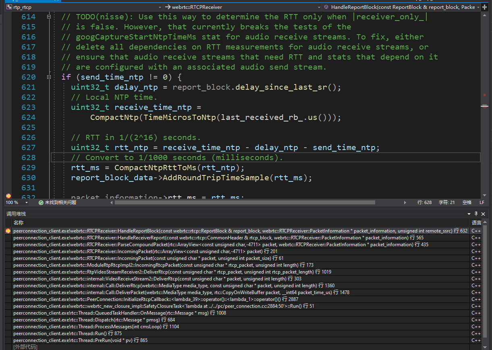
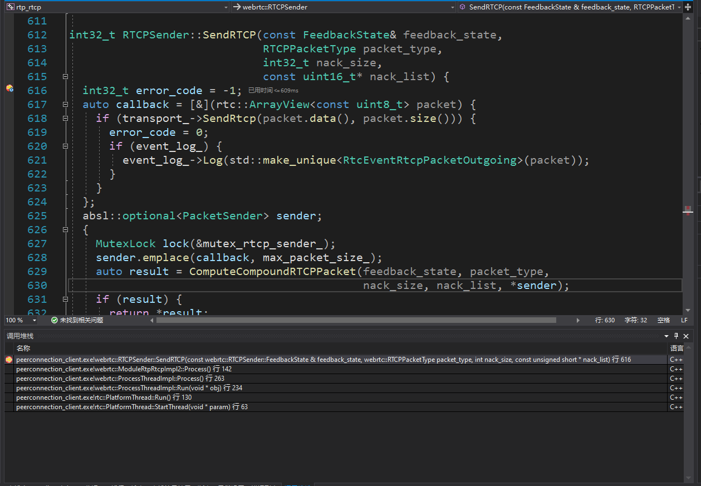
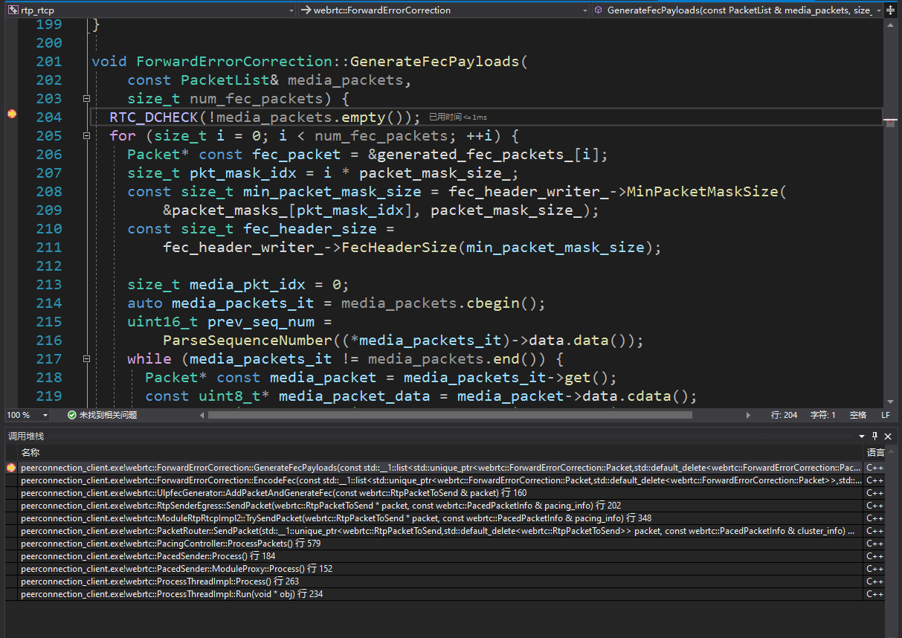

# Qos

- [Qos](#qos)
  - [RTT](#rtt)
  - [Nack](#nack)
  - [FEC](#fec)
  - [SVC](#svc)

## RTT

- [RR](../rtp_rtcp/README.md#receiver-report) 包

  

- RTT 更新调用堆栈

  

- RTT 更新关键函数

  ```c++
  void RTCPReceiver::HandleReportBlock(const ReportBlock& report_block,
                                      PacketInformation* packet_information,
                                      uint32_t remote_ssrc) {
    // This will be called once per report block in the RTCP packet.
    // We filter out all report blocks that are not for us.
    // Each packet has max 31 RR blocks.
    //
    // We can calc RTT if we send a send report and get a report block back.

    // |report_block.source_ssrc()| is the SSRC identifier of the source to
    // which the information in this reception report block pertains.

    // Filter out all report blocks that are not for us.
    if (registered_ssrcs_.count(report_block.source_ssrc()) == 0)
      return;

    last_received_rb_ = clock_->CurrentTime();

    ReportBlockData* report_block_data =
        &received_report_blocks_[report_block.source_ssrc()][remote_ssrc];
    RTCPReportBlock rtcp_report_block;
    rtcp_report_block.sender_ssrc = remote_ssrc;
    rtcp_report_block.source_ssrc = report_block.source_ssrc();
    rtcp_report_block.fraction_lost = report_block.fraction_lost();
    rtcp_report_block.packets_lost = report_block.cumulative_lost_signed();
    if (report_block.extended_high_seq_num() >
        report_block_data->report_block().extended_highest_sequence_number) {
      // We have successfully delivered new RTP packets to the remote side after
      // the last RR was sent from the remote side.
      last_increased_sequence_number_ = last_received_rb_;
    }
    rtcp_report_block.extended_highest_sequence_number =
        report_block.extended_high_seq_num();
    rtcp_report_block.jitter = report_block.jitter();
    rtcp_report_block.delay_since_last_sender_report =
        report_block.delay_since_last_sr();
    rtcp_report_block.last_sender_report_timestamp = report_block.last_sr();
    report_block_data->SetReportBlock(rtcp_report_block, rtc::TimeUTCMicros());

    int64_t rtt_ms = 0;
    uint32_t send_time_ntp = report_block.last_sr();
    // RFC3550, section 6.4.1, LSR field discription states:
    // If no SR has been received yet, the field is set to zero.
    // Receiver rtp_rtcp module is not expected to calculate rtt using
    // Sender Reports even if it accidentally can.

    // TODO(nisse): Use this way to determine the RTT only when |receiver_only_|
    // is false. However, that currently breaks the tests of the
    // googCaptureStartNtpTimeMs stat for audio receive streams. To fix, either
    // delete all dependencies on RTT measurements for audio receive streams, or
    // ensure that audio receive streams that need RTT and stats that depend on it
    // are configured with an associated audio send stream.
    if (send_time_ntp != 0) {
      uint32_t delay_ntp = report_block.delay_since_last_sr();
      // Local NTP time.
      uint32_t receive_time_ntp =
          CompactNtp(TimeMicrosToNtp(last_received_rb_.us()));

      // RTT in 1/(2^16) seconds.
      uint32_t rtt_ntp = receive_time_ntp - delay_ntp - send_time_ntp;
      // Convert to 1/1000 seconds (milliseconds).
      rtt_ms = CompactNtpRttToMs(rtt_ntp);
      report_block_data->AddRoundTripTimeSample(rtt_ms);

      packet_information->rtt_ms = rtt_ms;
    }

    packet_information->report_blocks.push_back(
        report_block_data->report_block());
    packet_information->report_block_datas.push_back(*report_block_data);
  }
  ```

## Nack

- 关闭 FEC，以便抓包分析

  ```c++
  // webrtc/media/engine\webrtc_video_engine.cc
  //supported_formats.push_back(webrtc::SdpVideoFormat(kRedCodecName));
  //supported_formats.push_back(webrtc::SdpVideoFormat(kUlpfecCodecName));
  ```

- 关闭 SRTP，以便抓包分析

  ```c++
  // webrtc/api/peer_connection_interface.h
  disable_encryption = true;
  ```

- Conductor::CreatePeerConnection(bool dtls)配置不生成密钥

  ```c++
  // webrtc/examples/peerconnection/client/conductor.cc
  if (!CreatePeerConnection(/*dtls=*/false)) {
    main_wnd_->MessageBox("Error", "CreatePeerConnection failed", true);
    DeletePeerConnection();
  }
  ```

- [Nack](../rtp_rtcp/README.md#generic-nack-message) 包

  

- 接收端触发 Nack 堆栈

  

- 接收端定时触发 Nack 堆栈

  

- [PLI](../rtp_rtcp/README.md#picture-loss-indication) 包

  

- 接收端触发 PLI 堆栈

  

- 丢包判断关键函数

  ```c++
  // Nack处理输入包
  int NackModule2::OnReceivedPacket(uint16_t seq_num,
                                    bool is_keyframe,
                                    bool is_recovered) {
    RTC_DCHECK_RUN_ON(worker_thread_);
    // TODO(philipel): When the packet includes information whether it is
    //                 retransmitted or not, use that value instead. For
    //                 now set it to true, which will cause the reordering
    //                 statistics to never be updated.
    bool is_retransmitted = true;

    // 第一次处理
    if (!initialized_) {
      // 记录最新序列
      newest_seq_num_ = seq_num;
      if (is_keyframe)
        keyframe_list_.insert(seq_num);  // 记录关键帧序列
      initialized_ = true;
      return 0;
    }

    // Since the |newest_seq_num_| is a packet we have actually received we know
    // that packet has never been Nacked.
    if (seq_num == newest_seq_num_)
      return 0;

    if (AheadOf(newest_seq_num_, seq_num)) {  // 乱序包到达
      // An out of order packet has been received.
      auto nack_list_it = nack_list_.find(seq_num);
      int nacks_sent_for_packet = 0;
      if (nack_list_it != nack_list_.end()) {
        nacks_sent_for_packet = nack_list_it->second.retries;
        // 从nack列表中删除
        nack_list_.erase(nack_list_it);
      }
      if (!is_retransmitted)
        UpdateReorderingStatistics(seq_num);
      return nacks_sent_for_packet;
    }

    // Keep track of new keyframes.
    if (is_keyframe)
      keyframe_list_.insert(seq_num);  // 记录关键帧

    // And remove old ones so we don't accumulate keyframes.
    auto it = keyframe_list_.lower_bound(seq_num - kMaxPacketAge);
    if (it != keyframe_list_.begin())
      keyframe_list_.erase(keyframe_list_.begin(), it);  // 删除边界点之外的关键帧

    if (is_recovered) {
      // 插入恢复队列
      recovered_list_.insert(seq_num);

      // Remove old ones so we don't accumulate recovered packets.
      auto it = recovered_list_.lower_bound(seq_num - kMaxPacketAge);
      if (it != recovered_list_.begin())
        recovered_list_.erase(recovered_list_.begin(),
                              it);  // 删除边界点之外的关键帧

      // Do not send nack for packets recovered by FEC or RTX.
      return 0;
    }

    // (newest_seq_num_ + 1, seq_num)加入到nack队列
    AddPacketsToNack(newest_seq_num_ + 1, seq_num);
    newest_seq_num_ = seq_num;

    // Are there any nacks that are waiting for this seq_num.
    std::vector<uint16_t> nack_batch = GetNackBatch(kSeqNumOnly);  // 获取丢包范围
    if (!nack_batch.empty()) {
      // This batch of NACKs is triggered externally; the initiator can
      // batch them with other feedback messages.
      nack_sender_->SendNack(nack_batch,
                            /*buffering_allowed=*/true);  // 发送nack 缓存模式
    }

    return 0;
  }

  void NackModule2::AddPacketsToNack(uint16_t seq_num_start,
                                    uint16_t seq_num_end) {
    // Called on worker_thread_.
    // Remove old packets.
    auto it = nack_list_.lower_bound(seq_num_end - kMaxPacketAge);
    nack_list_.erase(nack_list_.begin(), it);

    // If the nack list is too large, remove packets from the nack list until
    // the latest first packet of a keyframe. If the list is still too large,
    // clear it and request a keyframe.
    uint16_t num_new_nacks =
        ForwardDiff(seq_num_start, seq_num_end);  // 获取两包序列之间的范围
    if (nack_list_.size() + num_new_nacks > kMaxNackPackets) {
      while (RemovePacketsUntilKeyFrame() &&
            nack_list_.size() + num_new_nacks > kMaxNackPackets) {
      }

      if (nack_list_.size() + num_new_nacks > kMaxNackPackets) {  // 删除失败
        nack_list_.clear();
        RTC_LOG(LS_WARNING) << "NACK list full, clearing NACK"
                              " list and requesting keyframe.";
        keyframe_request_sender_->RequestKeyFrame();
        return;
      }
    }

    for (uint16_t seq_num = seq_num_start; seq_num != seq_num_end; ++seq_num) {
      // Do not send nack for packets that are already recovered by FEC or RTX
      if (recovered_list_.find(seq_num) !=
          recovered_list_.end())  // 已在恢复队列中 不需要操作
        continue;
      // 生成一个Nack记录
      NackInfo nack_info(seq_num, seq_num + WaitNumberOfPackets(0.5),
                        clock_->TimeInMilliseconds());
      RTC_DCHECK(nack_list_.find(seq_num) == nack_list_.end());
      nack_list_[seq_num] = nack_info;
    }
  }

  std::vector<uint16_t> NackModule2::GetNackBatch(NackFilterOptions options) {
    // Called on worker_thread_.

    bool consider_seq_num = options != kTimeOnly;
    bool consider_timestamp = options != kSeqNumOnly;
    Timestamp now = clock_->CurrentTime();
    std::vector<uint16_t> nack_batch;
    auto it = nack_list_.begin();
    while (it != nack_list_.end()) {
      TimeDelta resend_delay =
          TimeDelta::Millis(rtt_ms_);  // nack发送间隔必须大于rtt
      if (backoff_settings_) {
        resend_delay =
            std::max(resend_delay, backoff_settings_->min_retry_interval);
        if (it->second.retries > 1) {
          TimeDelta exponential_backoff =
              std::min(TimeDelta::Millis(rtt_ms_), backoff_settings_->max_rtt) *
              std::pow(backoff_settings_->base, it->second.retries - 1);
          resend_delay = std::max(resend_delay, exponential_backoff);
        }
      }

      // 超时不重发
      bool delay_timed_out =
          now.ms() - it->second.created_at_time >= send_nack_delay_ms_;
      // 间隔超过rtt才发送nack
      bool nack_on_rtt_passed =
          now.ms() - it->second.sent_at_time >= resend_delay.ms();
      // 包乱序才发送nack
      bool nack_on_seq_num_passed =
          it->second.sent_at_time == -1 &&
          AheadOrAt(newest_seq_num_, it->second.send_at_seq_num);
      if (delay_timed_out && ((consider_seq_num && nack_on_seq_num_passed) ||
                              (consider_timestamp && nack_on_rtt_passed))) {
        // 此包需要nack
        nack_batch.emplace_back(it->second.seq_num);
        ++it->second.retries;
        it->second.sent_at_time = now.ms();
        if (it->second.retries >= kMaxNackRetries) {
          RTC_LOG(LS_WARNING) << "Sequence number " << it->second.seq_num
                              << " removed from NACK list due to max retries.";
          it = nack_list_.erase(it);
        } else {
          ++it;
        }
        continue;
      }
      ++it;
    }
    return nack_batch;
  }
  ```

- 发送端重发调用堆栈

  

- 发送端重发关键函数

  ```c++
  int32_t RTPSender::ReSendPacket(uint16_t packet_id) {
    // Try to find packet in RTP packet history. Also verify RTT here, so that we
    // don't retransmit too often.
    absl::optional<RtpPacketHistory::PacketState> stored_packet =
        packet_history_->GetPacketState(packet_id);
    if (!stored_packet || stored_packet->pending_transmission) {
      // Packet not found or already queued for retransmission, ignore.
      return 0;
    }

    const int32_t packet_size = static_cast<int32_t>(stored_packet->packet_size);
    const bool rtx = (RtxStatus() & kRtxRetransmitted) > 0;

    std::unique_ptr<RtpPacketToSend> packet = //查找丢失包
        packet_history_->GetPacketAndMarkAsPending(
            packet_id, [&](const RtpPacketToSend& stored_packet) {
              // Check if we're overusing retransmission bitrate.
              // TODO(sprang): Add histograms for nack success or failure
              // reasons.
              std::unique_ptr<RtpPacketToSend> retransmit_packet;
              if (retransmission_rate_limiter_ &&
                  !retransmission_rate_limiter_->TryUseRate(packet_size)) {
                return retransmit_packet;
              }
              if (rtx) {
                retransmit_packet = BuildRtxPacket(stored_packet);//生成RTX包
              } else {
                retransmit_packet =
                    std::make_unique<RtpPacketToSend>(stored_packet);
              }
              if (retransmit_packet) {
                retransmit_packet->set_retransmitted_sequence_number(
                    stored_packet.SequenceNumber());
              }
              return retransmit_packet;
            });
    if (!packet) {
      return -1;
    }
    packet->set_packet_type(RtpPacketMediaType::kRetransmission);
    packet->set_fec_protect_packet(false);
    std::vector<std::unique_ptr<RtpPacketToSend>> packets;
    packets.emplace_back(std::move(packet));
    paced_sender_->EnqueuePackets(std::move(packets));//重传包入队

    return packet_size;
  }
  ```

## FEC

- fec 打包调用堆栈

  

- 调整 fec 参数调用堆栈

  

## SVC
